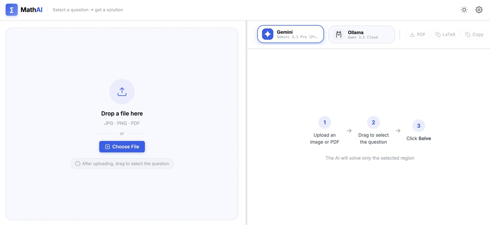
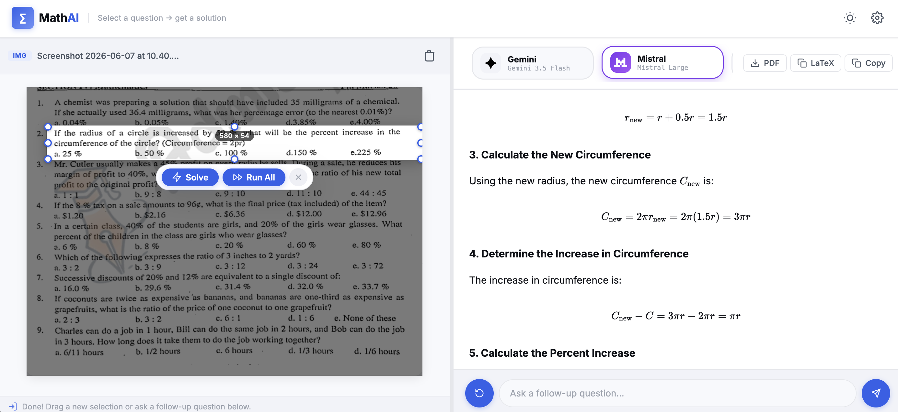

# 📐 MathAI

**Solve math and physics problems instantly with multi-modal AI.**

MathAI is a high-performance, responsive web application designed to help students and educators solve complex mathematical and physics problems. By leveraging state-of-the-art multi-modal AI models, MathAI can extract problems directly from images or PDFs and generate detailed, step-by-step solutions with professional LaTeX rendering and dynamic visualizations.




## 🚀 Live Demo

Check out the live application: **[https://mathai-solver.vercel.app/](https://mathai-solver.vercel.app/)**

---

## ✨ Key Features

- **🖼️ Multi-Input Support**: Upload images (JPG, PNG) or PDFs. Navigate through multi-page documents with ease.
- **🎯 Precision Selection**: Use the interactive crop tool to select exactly which problem you want the AI to solve.
- **🤖 Powerful AI Models**: Integrated with top-tier models:
  - **Google**: Gemini 1.5 Pro & Flash (Free tier available!)
  - **Mistral**: Pixtral, Mistral Large (Free tier available!)
  - **Groq**: Llama 3.2 Vision
  - **Local**: Support for Ollama models.
- **📝 Professional Rendering**: Beautiful mathematical equations powered by [KaTeX](https://katex.org/).
- **📊 Dynamic Visualizations**: Automatically generates diagrams and plots using:
  - **TikZ**: High-quality vector graphics via the Kroki API.
  - **Matplotlib**: In-browser Python plots via Pyodide (WebAssembly).
- **📱 Fully Responsive**: A seamless experience across desktop, tablet, and mobile devices.
- **🌓 Dark Mode**: Built-in light and dark themes for comfortable late-night study sessions.

---

## 🔐 Privacy & API Keys

Your privacy is a priority. MathAI is a **client-side first** application.

- **Local Storage**: All API keys are stored securely in your browser's `localStorage`. They are never sent to our servers.
- **Your Own Keys**: You can use your own API keys from Google, Mistral, or Groq. 
- **Free Tier Friendly**: Both Gemini and Mistral currently offer generous free tiers that are more than enough for daily math solving.

To get started, simply click the ⚙️ **Settings** icon in the app and enter your keys.

---

## 🛠️ Development & Setup

MathAI is built with simplicity in mind, using **Vanilla JavaScript** (ES Modules) without heavy frameworks.

### Prerequisites
- [Vercel CLI](https://vercel.com/cli) (required for local development with serverless functions).

### Local Development
1. **Clone the repository**:
   ```bash
   git clone https://github.com/your-username/mathAI.git
   cd mathAI
   ```

2. **Run the development server**:
   ```bash
   vercel dev
   ```
   The app will be available at `http://localhost:3000`.

### Dependencies
Most frontend libraries are loaded via CDN (see `index.html`), so no `npm install` is required for the core application.

---

## 🤝 Contributing

We welcome contributions! Whether it's a bug fix, a new feature, or improved documentation, please feel free to open a Pull Request. Check out our [CONTRIBUTING.md](CONTRIBUTING.md) for more details.

## 📄 License

This project is licensed under the MIT License - see the [LICENSE](LICENSE) file for details (or add one!).

---

**Built with ❤️ for the math community.**
